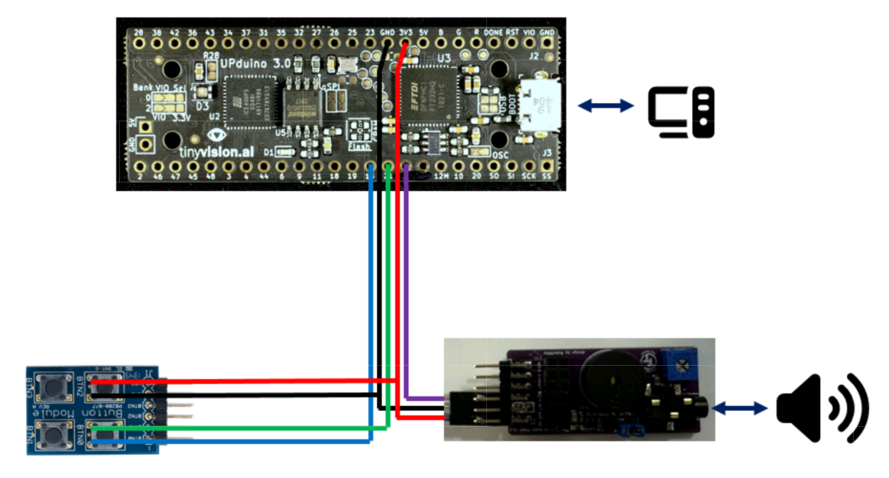
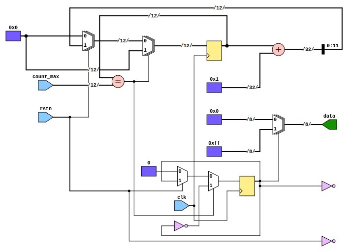
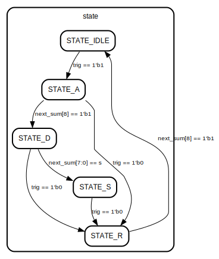
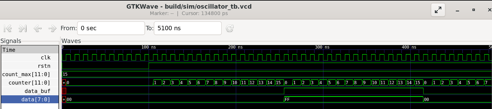
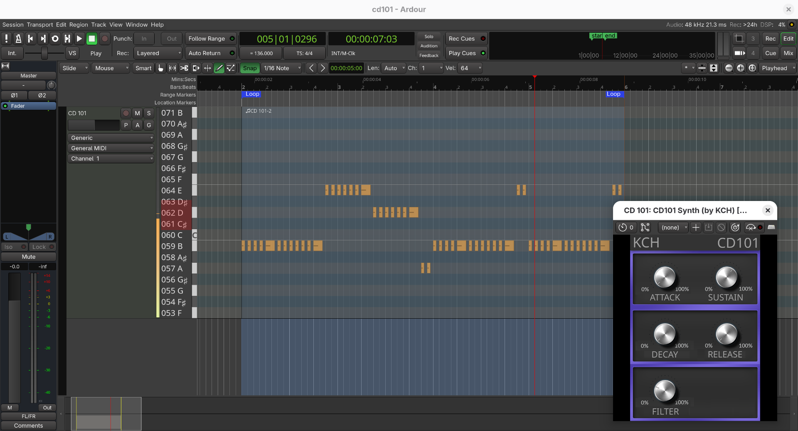
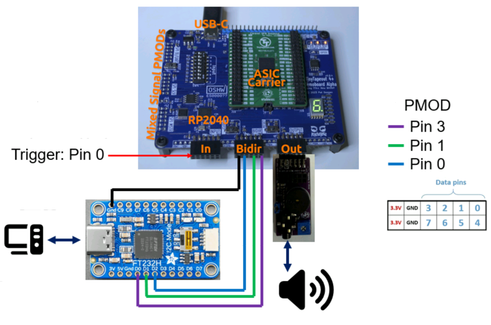

   

# KCH Chipdesign 101 Reference Design

This repository contains a simple hardware audio synthesizer.
It fits in one [Tiny Tapeout](https://tinytapeout.com/) tile and can be used to teach both chip design and the basic ideas behind audio synthesis.
The repository is set up so that it can be directly submitted to Tiny Tapeout and the design has been submitted to the TT10 run and can be tested with that board.
It can also be synthesized for the UPduino 3.0 FPGA, which can be useful for student workshops.

## More Documentation

Documentation materials for this project have unfortunately not been finalized yet, but the current state is available in the [cd101-docs](https://github.com/kit-kch/cd101-docs) repository.

## Using the FPGA Emulation

### EDA Tool Setup

To simplify development, we use a container based setup with [distrobox](https://distrobox.it).

Checkout the repo:
```bash
git clone https://github.com/kit-kch/cd101-tt.git
cd cd101-tt
```

```bash
distrobox create -i docker.io/ubuntu:24.04 fpga
distrobox enter fpga
sudo ./setup.sh
exit
```

When you now enter distrobox again, the tools will be set up properly:
```bash
distrobox enter fpga

⦗OSS CAD Suite⦘ 📦[jpfau@fpga cd101-tt]$ yosys -V
Yosys 0.48+77 (git sha1 eac2294ca, clang++ 18.1.8 -fPIC -O3)
```

### FPGA Board Setup

To test the design, you will need to connect an external low pass and a button module.
Use these boards:
* [UPduino v3.1 ICE40 FPGA Board](https://tinyvision.ai/products/fpga-development-board-upduino-v3-1?srsltid=AfmBOopawfVUNNePeYI-f1b1VEYlATlFLqBscarYBrJVQ_N_hbYVzSEj)
* [Tiny Tapeout Audio PMOD](https://github.com/MichaelBell/tt-audio-pmod)
* [Digilent Pmod BTN](https://digilent.com/reference/pmod/pmodbtn/start?srsltid=AfmBOorq1TLTMuljiMuctmZYIX58brU7r9eTV9q9wnxmNRfxH62lrLGN)

Instead of using the Audio PMOD, you can also build your own module as explained in [cd101-docs](https://github.com/kit-kch/cd101-docs).
Then connect the modules as shown below:



### Starting VSCode

* Open Visual Studio Code
* Install `Dev Containers` extension
* If you're using podman, configure `Dev Containers` to use `podman` instead of `docker` executable
* Press CTRL+SHIFT+P, Select "Dev Containers: Attach to Running Container"
* Select `fpga`
* Select `File` => `Open Folder` and select the checked out `cd101-tt` folder.

### Viewing Schematics and FSMs

* Go to the VSCode extenstions and install:
  * `mshr-h.veriloghdl`
  * `teros-technology.teroshdl`
* Open `src/hdl/oscillator.v`
* Press `Schematic Viewer` button on the top-right of the editor window.
  
* You can also view FSMs: Open `src/hdl/adsr.v`
* Click the `State machine viewer` in the same toolbar.
  

### Running Simulation

* Open a terminal: `Terminal` => `New Terminal`
* Compile the simulation for the oscillator: `iverilog -o oscillator_tb src/hdl/oscillator.v src/sim/oscillator_tb.v`
* Create the folder for the simulation output: `mkdir -p build/sim/`
* Run the simulation: `./oscillator_tb`
* View the waveform: `gtkwave build/sim/oscillator_tb.vcd`
  

### Programming the FPGA

To generate the bitstream (`build/fpga_top.bin`):
```bash
make -f FPGA.mk bitstream
```

To program the FPGA SRAM (temporarily):
```bash
make -f FPGA.mk upload
```
To program the FPGA Flash (permanently):
```bash
make -f FPGA.mk upload-flash
```

Note: This may not work in Visual Studio Code. Try running directly in a terminal, after running `distrobox enter fpga`.

### User Software

Once the FPGA is programmed, you can run the [user software](https://github.com/kit-kch/cd101-plugin).
Please note:
* You may have to press the reset button once (BTN1) to ensure proper reset.
* You will not hear any sound when pressing the trigger button (BTN0) unless you have run the user software at least once.
  This is required to set the parameters for the synth.

Here's an example using the CLI Tool:
```bash
./cd101 440 0.5 1 40 0.8 500
```
Refer to the [user software](https://github.com/kit-kch/cd101-plugin) for details.

You can also run the LV2 plugin with an DAW.
An example Ardour project is provided in the [cd101-docs](https://github.com/kit-kch/cd101-docs) repository.



## Tiny Tapeout ASIC Tests

If you've got the TT10 chip with the design, connect buttons and Audio PMOD as shown below:



You can use the same user software as for the FPGA case.

**TODO: Also need to document how to configure base frequency for design (20.5 MHz) and select the design on TT base board**

## Tapeout with Tiny Tapeout

### What is Tiny Tapeout?

Tiny Tapeout is an educational project that aims to make it easier and cheaper than ever to get your digital and analog designs manufactured on a real chip.

To learn more and get started, visit https://tinytapeout.com.

### Set up your Verilog project

The GitHub action will automatically build the ASIC files using [OpenLane](https://www.zerotoasiccourse.com/terminology/openlane/).

### Enable GitHub actions to build the results page

- [Enabling GitHub Pages](https://tinytapeout.com/faq/#my-github-action-is-failing-on-the-pages-part)

### Resources

- [FAQ](https://tinytapeout.com/faq/)
- [Digital design lessons](https://tinytapeout.com/digital_design/)
- [Learn how semiconductors work](https://tinytapeout.com/siliwiz/)
- [Join the community](https://tinytapeout.com/discord)
- [Build your design locally](https://www.tinytapeout.com/guides/local-hardening/)

### What next?

- [Submit your design to the next shuttle](https://app.tinytapeout.com/).

## Other Versions

Here's a fork which generates saw waves instead of rectangle waves: [jpf91/cd101-tt-saw](https://github.com/jpf91/cd101-tt-saw).
Please note that this requires [modified user software](https://github.com/kit-kch/cd101-plugin/issues/1).